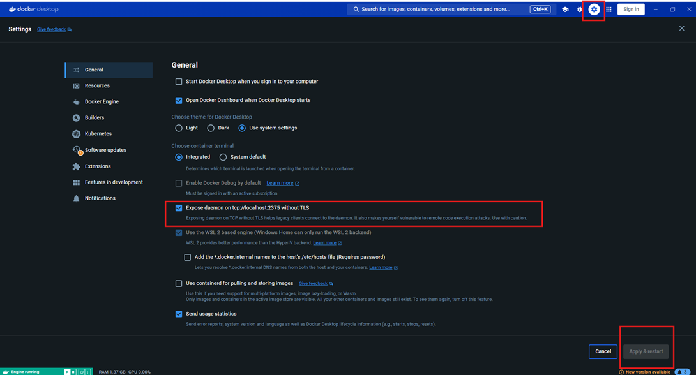

# **Docker + traefik Ambiente Windows**

## Para utilizar Docker + Traefik em ambiente Windows deve-se:

1. Export api Docker no Docker Desktop, depois aplicar e reiniciar o Docker



2. Testar a apli do docker, verificar se a mesta esta exposta, deve executar:
> curl http://localhost:2375/version

3. Abrir o bloco de notas como administrador e editar o arquivo:
> C:\Windows\System32\drivers\etc\hosts

Adicionar no final do arquivo as informações:
```
127.0.0.1 traefik.local
127.0.0.1 frontend.local
127.0.0.1 backend.local
```
4. Exemplo arquivo do Docker-compose utilizado no teste:

```
services:
  
  traefik:
    image: traefik
    ports:
      - 8000:80
    networks:
      - "web"
    command:
     - "--providers.docker=true"
     - "--entrypoints.web.address=:80"
     - "--providers.docker.endpoint=http://host.docker.internal:2375"
     - "--log.level=DEBUG"
     - "--api=true"
    labels:
      - "traefik.enable=true"
      - "traefik.http.routers.traefik.entrypoints=web"
      - "traefik.http.services.traefik.loadbalancer.server.port=8080"
      - "traefik.http.routers.traefik.rule=Host(`traefik.local`)"
      - "traefik.http.routers.traefik.service=api@internal"
      #- "traefik.http.routers.traefik.middlewares=auth" # Habilitar autenticação básica
      #- "traefik.http.middlewares.auth.basicauth.users=usuario:senhaBcrypt" # Senha bcrypr
  
  frontend:
    image: nginxdemos/hello
    ports:
      - 80
    networks:
      - "web"
    deploy:
      replicas: 2
    labels:
      - "traefik.enable=true"
      - "traefik.http.routers.frontend.entrypoints=web"
      - "traefik.http.routers.frontend.rule=Host(`frontend.local`)"
  
  backend:
    image: nginxdemos/hello
    ports:
      - 80
    networks:
      - "web"
    deploy:
      replicas: 2
    labels:
      - "traefik.enable=true"
      - "traefik.http.routers.backend.entrypoints=web"
      - "traefik.http.routers.backend.rule=Host(`backend.local`)"

networks:
  web:
    external: true
#docker network create web
```

Para esta acessando, digite no navegador uma das opções: 

```
traefik.local:8000 - Para dashboard
frontend.local:8000
backend.local:8000
```